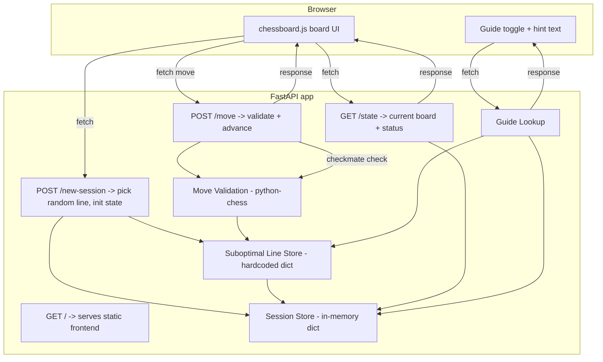

# Chess Opening Trainer — Scholar's Mate MVP (v3: FastAPI implementation)

## Goal
Practice executing Scholar's Mate as White against 3-5 randomly-selected suboptimal Black
lines, with an optional move guide. Checkmate may take 4-6 moves depending on the line.
No hosting — distributed as a GitHub repo, run locally.

## Stack
- **Backend:** FastAPI + `python-chess` (legality checks, checkmate detection)
- **Frontend:** Static HTML/CSS/JS, `chessboard.js` for the board — served by FastAPI as
  static files (FastAPI is backend-only; it hosts the frontend, it doesn't generate it)
- **State:** In-memory per session (dict keyed by session id), no database

## Component diagram



## Endpoints

| Method | Path            | Purpose                                                        |
|--------|-----------------|------------------------------------------------------------------|
| GET    | `/`             | Serve the static frontend (index.html, JS, CSS)                |
| POST   | `/new-session`  | Start a session: randomly pick one of the 3-5 lines, reset board |
| POST   | `/move`         | Submit White's move: validate legality, check vs. active line, apply Black's reply, check mate |
| GET    | `/state`        | Return current board FEN/PGN + session status (`in_progress` / `success` / `off_line`) |
| GET    | `/guide`        | Return the correct next White move for the active session (used only when toggle is on) |

## Project structure

```
scholars-mate-trainer/
├── backend/
│   ├── main.py            # FastAPI app, endpoints
│   ├── game.py            # Session state, move validation, checkmate check (python-chess)
│   ├── lines.py           # Hardcoded suboptimal Black lines (3-5 full move sequences)
│   └── requirements.txt
├── frontend/
│   ├── index.html
│   ├── app.js              # calls backend endpoints, drives chessboard.js
│   └── style.css
└── README.md               # clone/install/run instructions
```

## Session flow
1. Browser loads `/`, calls `POST /new-session` → backend randomly selects a line, stores it
   keyed by session id, returns session id + starting board.
2. User plays White's move → `POST /move` → backend validates legality, checks it matches
   the active line's expected move.
   - No match → session status `off_line`, game ends.
   - Match → apply move, check checkmate.
     - Checkmate → session status `success`, game ends.
     - No checkmate → apply the active line's next Black move, return updated board.
3. If guide toggle is on, frontend calls `GET /guide` before each White move to display the
   expected move.

## Out of scope (unchanged from v2)
Feedback/hint engine beyond the guide lookup, progress tracking/analytics, AI coach,
multiple openings, user accounts, persistence beyond the session, hosted deployment.
